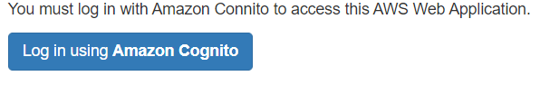

# Securing a Web Application by using Amazon Cognito

Amazon Cognito lets you add user sign-up, sign-in, and access control to your web applications quickly and easily. Amazon Cognito scales to millions of users and supports sign-in with social identity providers, such as Facebook, Google, and Amazon, and enterprise identity providers such as OAuth2. In this AWS tutorial, OAuth2 and Amazon Cognito are used to secure a web application. This means a user has to log into the application by using credentials of a user defined in an Amazon Cognito User Pool. For example, when a user accesses a web application, they see a web page that lets anonymous users view a log in page, as shown in this illustration.   

When the user clicks the log in button, they are presented with a log in form where they can enter their user credentials.

