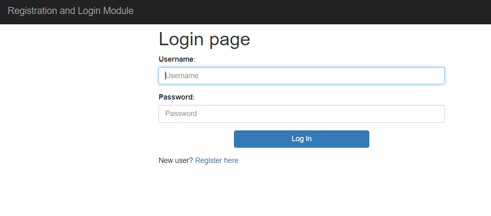
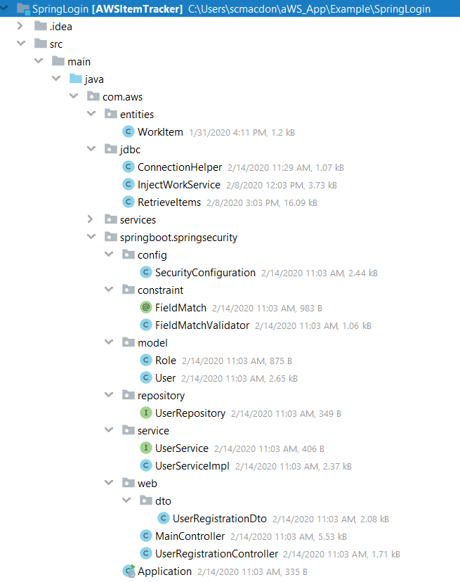

#  Creating an AWS Tracking Application using Spring Boot and AWS Services

You can develop an AWS web application that tracks and reports on items by using these Amazon Web Services: 

+ Amazon Relational Database Service (RDS)
+ Amazon Simple Email Service (SES)
+ Amazon DynamoDB
+ Amazon S3
+ AWS Elastic Beanstalk

In addition, the AWS Tracking application uses Spring Boot APIs to build a model, views, and controllers. The AWS Tracking application is a secure web application that uses Spring Boot Security and requires a user to log into the application. For more information, see https://www.tutorialspoint.com/spring_boot/spring_boot_securing_web_applications.htm. 

The following illustration shows the login page. 

After a user logs into the system, they can perform these operations: 

+ Enter a new item into the system
+ View all active items
+ View archived items that have been completed. 
+ Modify active items
+ Send a report to an email recipient. 

The following illustration shows the new item section of the application. 

A user can retrive either active or archive items by clicking the **Get Data** button. A data set is retrieved from an AWS RDS database and displayed in the web application, as shown in this illustration. 

Finally, the user can select the email recipient from the **Select Manager** dropdown field and click the **Send Report** button. All active items are placed into a data set and used to dynamically create an Excel document by using the **jxl.write.WritableWorkbook** API. Then the application uses Amazon SES to email the document to the selected email recipient.

This development document guides you through creating the AWS Tracker application. Once the application is developed, this document teaches you how to deploy it to the AWS Elastic Beanstalk.

The following illustration shows you the structure of the Java project that you create by following this development document.

To follow along with the document, you require the following:

+ An AWS Account.
+ A Java IDE (for this development document, the IntelliJ IDE is used).
+ Java 1.8 SDK and Maven.

**Cost to Complete**: The AWS Services included in this document are included in the AWS Free Tier.

**Note**: Please be sure to terminate all of the resources created during this document to ensure that you are no longer charged.

## Section 1 - Create an IntelliJ Project named AWSItemTracker

Create a new IntelliJ project named **AESItemTracker** by performing these steps:

1. From within the IntelliJ IDE, click **File**, **New**, **Project**. 
2. In the **New Project** dialog, select **Maven**. 
3. Click **Next**
4. In the **GroupId** field, enter **spring-aws**. 
5. In the **ArtifactId** field, enter **AWSItemTracker**. 
6. Click **Next**.
7. Click **Finish**. 

## Section 2 - Add the Spring POM Dependencies to your project

At this point, you have a new project named **AWSItemTracker**, as shown in this illustration. 

Inside the **project** element in the **pom.xml** file, add the **spring-boot-starter-parent** dependency:
  
     <parent>
        <groupId>org.springframework.boot</groupId>
        <artifactId>spring-boot-starter-parent</artifactId>
        <version>2.0.4.RELEASE</version>
        <relativePath /> <!-- lookup parent from repository -->
    </parent>
    
Also, add the following Spring Boot **dependency** elements inside the **dependencies** element.

    <dependency>
        <groupId>org.springframework.boot</groupId>
        <artifactId>spring-boot-starter-web</artifactId>
    </dependency>
    <dependency>
        <groupId>org.springframework.boot</groupId>
        <artifactId>spring-boot-starter-security</artifactId>
    </dependency>
    <dependency>
        <groupId>org.springframework.boot</groupId>
        <artifactId>spring-boot-starter-data-jpa</artifactId>
    </dependency>
    <dependency>
        <groupId>org.springframework.boot</groupId>
        <artifactId>spring-boot-starter-thymeleaf</artifactId>
    </dependency>
    <dependency>
        <groupId>org.thymeleaf.extras</groupId>
        <artifactId>thymeleaf-extras-springsecurity4</artifactId>
    </dependency>
    <dependency>
        <groupId>org.springframework.boot</groupId>
        <artifactId>spring-boot-devtools</artifactId>
        <scope>runtime</scope>
    </dependency>
  
At this point, you **pom.xml** file resembles the following file. 

    <?xml version="1.0" encoding="UTF-8"?>
    <project xmlns="http://maven.apache.org/POM/4.0.0"
         xmlns:xsi="http://www.w3.org/2001/XMLSchema-instance"
         xsi:schemaLocation="http://maven.apache.org/POM/4.0.0 http://maven.apache.org/xsd/maven-4.0.0.xsd">
    <modelVersion>4.0.0</modelVersion>

    <groupId>aws-spring</groupId>
    <artifactId>AWSItemTracker</artifactId>
    <version>1.0-SNAPSHOT</version>

    <parent>
        <groupId>org.springframework.boot</groupId>
        <artifactId>spring-boot-starter-parent</artifactId>
        <version>2.0.4.RELEASE</version>
        <relativePath /> <!-- lookup parent from repository -->
    </parent>

    <dependencies>
    <dependency>
        <groupId>org.springframework.boot</groupId>
        <artifactId>spring-boot-starter-web</artifactId>
    </dependency>
    <dependency>
        <groupId>org.springframework.boot</groupId>
        <artifactId>spring-boot-starter-security</artifactId>
    </dependency>
    <dependency>
        <groupId>org.springframework.boot</groupId>
        <artifactId>spring-boot-starter-data-jpa</artifactId>
    </dependency>
    <dependency>
        <groupId>org.springframework.boot</groupId>
        <artifactId>spring-boot-starter-thymeleaf</artifactId>
    </dependency>
    <dependency>
        <groupId>org.thymeleaf.extras</groupId>
        <artifactId>thymeleaf-extras-springsecurity4</artifactId>
    </dependency>
    <dependency>
        <groupId>org.springframework.boot</groupId>
        <artifactId>spring-boot-devtools</artifactId>
        <scope>runtime</scope>
    </dependency>
    </dependencies>
  </project>
