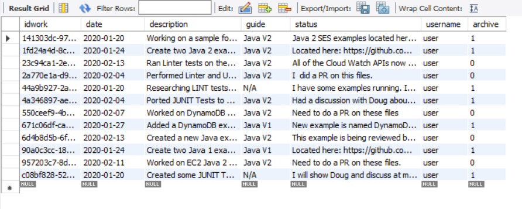

#  Creating a Secure AWS Tracking Application using Spring Boot and AWS Services

You can develop an AWS web application that tracks and reports on work items by using these Amazon Web Services: 

+ Amazon Relational Database Service (RDS)
+ Amazon Simple Email Service (SES)
+ Amazon S3
+ AWS Elastic Beanstalk

In addition, the *AWS Tracking* application uses Spring Boot APIs to build a model, views, and a controller. The *AWS Tracking* application is a secure web application that uses Spring Boot Security and requires a user to log into the application. For more information, see https://www.tutorialspoint.com/spring_boot/spring_boot_securing_web_applications.htm. 

This application uses a model that is based on a work item and contains these attributes: 

+ **date** - the start date of the item 
+ **description** - the description of the item
+ **guide** - the deliverable that is impacted by the item 
+ **username** - the person whom performs the work item
+ **status** - the status of the item 
+ **archive** - whether this item is completed or still being worked on

The following illustration shows the login page. 

After a user logs into the system, they can perform these tasks: 

+ Enter a new item into the system
+ View all active items
+ View archived items that have been completed. 
+ Modify active items
+ Send a report to an email recipient. 

The following illustration shows the new item section of the application. 

A user can retrive either active or archive items by clicking the **Get Data** button. A data set is retrieved from an AWS RDS database and displayed in the web application, as shown in this illustration. 

The database is MySQL and contains a table named **work** that contains these fields:

+ **idwork** - A VARCHAR(45) value that represents the PK. 
+ **date** - a Date value that specifies the data the item was added
+ **description** - a VARCHAR(300) that describes the item 
+ **guide** - a VARCHAR(45) value that represents the deliverable being worked on
+ **status** - a  VARCHAR(300) value that describes describes the status
+ **username** - a VARCHAR(45) value that represents the user whom entered the item 
+ **archive** - a TINYINT(4)value that represents whether this is an active or archive item 

The following illustration shows the **work** table. 

Finally, the user can select the email recipient from the **Select Manager** dropdown field and click the **Send Report** button. All active items are placed into a data set and used to dynamically create an Excel document by using the **jxl.write.WritableWorkbook** API. Then the application uses Amazon SES to email the document to the selected email recipient.

This development document guides you through creating the *AWS Tracker* application. Once the application is developed, this document teaches you how to deploy it to the AWS Elastic Beanstalk.

The following illustration shows you the structure of the Java project that you create by following this development document.

**Note**: All of the Java code required to complete this document is located in this Github repository. 

To follow along with the document, you require the following:

+ An AWS Account.
+ A Java IDE (for this development document, the IntelliJ IDE is used).
+ Java 1.8 JDK 
+ Maven 3.6 or higher.

**Cost to Complete**: The AWS Services included in this document are included in the AWS Free Tier.

**Note**: Please be sure to terminate all of the resources created during this document to ensure that you are no longer charged.

## Section 1 - Create an IntelliJ project named AWSItemTracker

Create a new IntelliJ project named **AESItemTracker** by performing these steps:

1. From within the IntelliJ IDE, click **File**, **New**, **Project**. 
2. In the **New Project** dialog, select **Maven**. 
3. Click **Next**
4. In the **GroupId** field, enter **spring-aws**. 
5. In the **ArtifactId** field, enter **AWSItemTracker**. 
6. Click **Next**.
7. Click **Finish**. 

## Section 2 - Add the Spring POM dependencies to your project

At this point, you have a new project named **AWSItemTracker**, as shown in this illustration. 

Inside the **project** element in the **pom.xml** file, add the **spring-boot-starter-parent** dependency:
  
     <parent>
        <groupId>org.springframework.boot</groupId>
        <artifactId>spring-boot-starter-parent</artifactId>
        <version>2.0.4.RELEASE</version>
        <relativePath /> <!-- lookup parent from repository -->
    </parent>
    
Also, add the following Spring Boot **dependency** elements inside the **dependencies** element.

    <dependency>
        <groupId>org.springframework.boot</groupId>
        <artifactId>spring-boot-starter-web</artifactId>
    </dependency>
    <dependency>
        <groupId>org.springframework.boot</groupId>
        <artifactId>spring-boot-starter-security</artifactId>
    </dependency>
    <dependency>
        <groupId>org.springframework.boot</groupId>
        <artifactId>spring-boot-starter-data-jpa</artifactId>
    </dependency>
    <dependency>
        <groupId>org.springframework.boot</groupId>
        <artifactId>spring-boot-starter-thymeleaf</artifactId>
    </dependency>
    <dependency>
        <groupId>org.thymeleaf.extras</groupId>
        <artifactId>thymeleaf-extras-springsecurity4</artifactId>
    </dependency>
    <dependency>
        <groupId>org.springframework.boot</groupId>
        <artifactId>spring-boot-devtools</artifactId>
        <scope>runtime</scope>
    </dependency>
    
**Note** - Ensure that you are using Java 1.8 (shown below).
  
At this point, you **pom.xml** file resembles the following file. 

    <?xml version="1.0" encoding="UTF-8"?>
    <project xmlns="http://maven.apache.org/POM/4.0.0"
         xmlns:xsi="http://www.w3.org/2001/XMLSchema-instance"
         xsi:schemaLocation="http://maven.apache.org/POM/4.0.0 http://maven.apache.org/xsd/maven-4.0.0.xsd">
    <modelVersion>4.0.0</modelVersion>

    <groupId>aws-spring</groupId>
    <artifactId>AWSItemTracker</artifactId>
    <version>1.0-SNAPSHOT</version>
    
    <properties>
        <project.build.sourceEncoding>UTF-8</project.build.sourceEncoding>
        <project.reporting.outputEncoding>UTF-8</project.reporting.outputEncoding>
        <java.version>1.8</java.version>
    </properties>
    
    <parent>
        <groupId>org.springframework.boot</groupId>
        <artifactId>spring-boot-starter-parent</artifactId>
        <version>2.0.4.RELEASE</version>
        <relativePath /> <!-- lookup parent from repository -->
    </parent>

    <dependencies>
    <dependency>
        <groupId>org.springframework.boot</groupId>
        <artifactId>spring-boot-starter-web</artifactId>
    </dependency>
    <dependency>
        <groupId>org.springframework.boot</groupId>
        <artifactId>spring-boot-starter-security</artifactId>
    </dependency>
    <dependency>
        <groupId>org.springframework.boot</groupId>
        <artifactId>spring-boot-starter-data-jpa</artifactId>
    </dependency>
    <dependency>
        <groupId>org.springframework.boot</groupId>
        <artifactId>spring-boot-starter-thymeleaf</artifactId>
    </dependency>
    <dependency>
        <groupId>org.thymeleaf.extras</groupId>
        <artifactId>thymeleaf-extras-springsecurity4</artifactId>
    </dependency>
    <dependency>
        <groupId>org.springframework.boot</groupId>
        <artifactId>spring-boot-devtools</artifactId>
        <scope>runtime</scope>
    </dependency>
    </dependencies>
  </project>

## Section 3 - Setup the Java packages in your project

Create a Java package in the **main/java** folder named **com.aws**. 

The Java files go into these subpackages:

The following list describes these packages:

+ **entities** - contains Java files that represent the model. In this example, the model class is named **WorkItem**. 
+ **jdbc** - contains Java files that use the JDBC API to interact with the RDS database.
+ **services** - contains Java files that invoke AWS Services. For example, the  **com.amazonaws.services.simpleemail.AmazonSimpleEmailService** is used within a Java file to send email messages.
+ **securingweb** - contains all of the Java files required for Spring Security. 

## Section 4 - Create the Java logic for a secure web application

Create Spring Security application logic that secures the web application with a login form that requires a user to provide credentials. In this application, a Java class sets up an in-memory user store that contains a single user (the user name is **user** and the password is **password**.)

**NOTE** - For more information about Spring Security, see https://spring.io/guides/gs/securing-web/. 

### Create the Spring Security classes

Create a new Java package named **com.aws.securingweb**. Next, create these classes in this package:

+ **SecuringWebApplication** 
+ **WebSecurityConfig**

To create the **SecuringWebApplication** and **WebSecurityConfig** classes: 

1. Create the **com.aws.securingweb** package. 
2. Create the **SecuringWebApplication** class in this package. 
3. Copy the code from the **SecuringWebApplication** class and paste it into this class in your project.
4. Create the **WebSecurityConfig** class in this package.
5. Copy the code from the **WebSecurityConfig** class and paste it into this class in your project.

The following Java code represents the **SecuringWebApplication** class.

    package com.aws.securingweb;

    import org.springframework.boot.SpringApplication;
    import org.springframework.boot.autoconfigure.SpringBootApplication;

    @SpringBootApplication
    public class SecuringWebApplication {

    public static void main(String[] args) throws Throwable {
        SpringApplication.run(SecuringWebApplication.class, args);
    }

}

The following Java code represents the **WebSecurityConfig** class.

    package com.aws.securingweb;

    import org.springframework.context.annotation.Bean;
    import org.springframework.context.annotation.Configuration;
    import org.springframework.security.config.annotation.web.builders.HttpSecurity;
    import org.springframework.security.config.annotation.web.configuration.EnableWebSecurity;
    import org.springframework.security.config.annotation.web.configuration.WebSecurityConfigurerAdapter;
    import org.springframework.security.core.userdetails.User;
    import org.springframework.security.core.userdetails.UserDetails;
    import org.springframework.security.core.userdetails.UserDetailsService;
    import org.springframework.security.provisioning.InMemoryUserDetailsManager;
    import org.springframework.security.web.util.matcher.AntPathRequestMatcher;

    @Configuration
    @EnableWebSecurity
    public class WebSecurityConfig extends WebSecurityConfigurerAdapter {
     @Override
    protected void configure(HttpSecurity http) throws Exception {
        http
                .authorizeRequests()
                .antMatchers(
                        "/js/**",
                        "/css/**",
                        "/img/**",
                        "/webjars/**").permitAll()
                .anyRequest().authenticated()
                .and()
                .formLogin()
                .loginPage("/login")
                .permitAll()
                .and()
                .logout()
                .invalidateHttpSession(true)
                .clearAuthentication(true)
                .logoutRequestMatcher(new AntPathRequestMatcher("/logout"))
                .logoutSuccessUrl("/login?logout")
                .permitAll();

        http.csrf().disable();
    }

    @Bean
    @Override
    public UserDetailsService userDetailsService() {
        UserDetails user =
                User.withDefaultPasswordEncoder()
                        .username("user")
                        .password("password")
                        .roles("USER")
                        .build();

        return new InMemoryUserDetailsManager(user);
     }
    }
    
 **Note** - In this example, the user credentials ot log into the application is user/password.  

### Create the main controller class

Within the **com.aws.securingweb** package, create the controller class named **MainController**. This class is responsible for handling the HTTP Requests. For example, if a GET operation is made by the view, the **MainController** handles this request and returns a data set that is displayed in the view. In this example, the data set is obtained from the MySQL database located in the AWS Cloud. 

**NOTE**: In this application, AJAX request are made to invoke controller methods. The syntax of the AJAX request are shown later in this document. 

To create the **MainController** class: 

1. In the **com.aws.securingweb** package, create the **MainController** class. 
2. Copy the code from the **MainController** class and paste it into this class in your project.

The following Java code represents the **MainController** class. 

    package com.aws.securingweb;

    import com.aws.entities.WorkItem;
    import com.aws.jdbc.RetrieveItems;
    import org.springframework.security.core.context.SecurityContextHolder;
    import org.springframework.stereotype.Controller;
    import org.springframework.ui.Model;
    import org.springframework.web.bind.annotation.*;
    import com.aws.jdbc.InjectWorkService;
    import com.aws.services.WriteExcel;
    import com.aws.services.SendMessages;
    import javax.servlet.http.HttpServletRequest;
    import javax.servlet.http.HttpServletResponse;
    import java.util.List;

    @Controller
    public class MainController {

    @GetMapping("/")
    public String root() {
        return "index";
    }

    @GetMapping("/login")
    public String login(Model model) {
        return "login";
    }

    //This is invoked when we want to build a report
    @RequestMapping(value = "/report", method = RequestMethod.GET)
    @ResponseBody
    String getReport(HttpServletRequest request, HttpServletResponse response) {

        //Get the work item list
        //Get the Logged in User
        org.springframework.security.core.userdetails.User user2 = (org.springframework.security.core.userdetails.User) SecurityContextHolder.getContext().getAuthentication().getPrincipal();
        String name = user2.getUsername();
        RetrieveItems ri = new RetrieveItems();
        List<WorkItem> theList =  ri.getItemsDataSQLReport(name);

        WriteExcel writeExcel = new WriteExcel();
        SendMessages sm = new SendMessages();
        java.io.InputStream is = writeExcel.exportExcel(theList);

        try {
            //copyInputStreamToFile(is, testFile);
            sm.SendReport(is);
        }
        catch (Exception e){
            e.getStackTrace();
        }
        return "Report is created";
    }

    //This is invoked when we want to change the value of a work item
    @RequestMapping(value = "/archive", method = RequestMethod.POST)
    @ResponseBody
    String ArchieveWorkItem(HttpServletRequest request, HttpServletResponse response) {
        String id = request.getParameter("id");

        RetrieveItems ri = new RetrieveItems();
        WorkItem item= ri.GetWorkItembyId(id);
        // db.injectDynamoItem(item);
        ri.FlipItemArchive(id );
        return id ;
    }

    //This is invoked when we want to change the value of a work item
    @RequestMapping(value = "/changewi", method = RequestMethod.POST)
    @ResponseBody
    String ChangeWorkItem(HttpServletRequest request, HttpServletResponse response) {
        String id = request.getParameter("id");
        String description = request.getParameter("description");
        String status   = request.getParameter("status");

        InjectWorkService ws = new InjectWorkService();
        return ws.modifySubmission(id, description, status) ;
    }

    //This is invoked when we retrieve all items for a given writer
    @RequestMapping(value = "/retrieve", method = RequestMethod.GET)
    @ResponseBody
    String retrieveItems(HttpServletRequest request, HttpServletResponse response) {

        //Get the Logged in User
        org.springframework.security.core.userdetails.User user2 = (org.springframework.security.core.userdetails.User) SecurityContextHolder.getContext().getAuthentication().getPrincipal();
        String name = user2.getUsername();

        RetrieveItems ri = new RetrieveItems();

        String type = request.getParameter("type");
        //Pass back all data from WOrk table

        if (type.equals("active"))
            return ri.getItemsDataSQL(name) ;
        else
            return ri.getArchiveData(name) ;
    }

    //This is invoked when we want to return a work item to modify
    @RequestMapping(value = "/modify", method = RequestMethod.POST)
    @ResponseBody
    String modifyWork(HttpServletRequest request, HttpServletResponse response) {
        String id = request.getParameter("id");
        RetrieveItems ri = new RetrieveItems();
        return ri.GetItemSQL(id) ;
    }

    //This is invoked when we retrieve all items for a given writer
    @RequestMapping(value = "/work", method = RequestMethod.POST)
    @ResponseBody
    String getWork(HttpServletRequest request, HttpServletResponse response) {

        InjectWorkService ws = new InjectWorkService();

        WorkItem item = new WorkItem();
        String description = request.getParameter("description");
        String date = request.getParameter("date");
        String guide = request.getParameter("guide");
        String status = request.getParameter("status");

        item.SetDate(date);
        item.SetName(getLoggedUser());
        item.SetDescription(description);
        item.SetGuide(guide);
        item.SetStatus(status);

        // Persist the data
        String itemNum =ws.injestNewSubmission(item);

        //Document xml = s3.toXml(allBuckets);
        //String bucketsStr= s3.convertToString(xml);
        return itemNum ;
    }

    private String getLoggedUser()
    {
        //Get the Logged in User
        org.springframework.security.core.userdetails.User user2 = (org.springframework.security.core.userdetails.User) SecurityContextHolder.getContext().getAuthentication().getPrincipal();
        String name = user2.getUsername();
        return name;
      }
    }

## Create the WorkItem class

Create a new Java package named **com.aws.entities**. Next, create a class, that represents the model named **WorkItem**. To create the **WorkItem** class: 

1. In the **com.aws.entities** package, create the **WorkItem** class. 
2. Copy the code from the **WorkItem** class and paste it into this class in your project.

#### MainController** class
The following Java code represents the **MainController** class. 

    package com.aws.entities;

    public class WorkItem {

      private String id;
      private String name;
      private String guide ;
      private String date;
      private String description;
      private String status;

      public void SetId (String id)
      {
        this.id = id;
      }

      public String getId()
      {
        return this.id;
      }

      public void SetStatus (String status)
      {
        this.status = status;
      }

      public String getStatus()
      {
        return this.status;
      }

      public void SetDescription (String description)
      {
        this.description = description;
      }

      public String getDescription()
      {
        return this.description;
      }

      public void SetDate (String date)
      {
        this.date = date;
      }

      public String getDate()
      {
        return this.date;
      }

      public void SetName (String name)
      {
        this.name = name;
      }

      public String getName()
      {
        return this.name;
      }

      public void SetGuide (String guide)
      {
        this.guide = guide;
      }

      public String getGuide()
      {
        return this.guide;
      }
    }

## Create the JDBC Classes

Create a new Java package named **com.aws.jdbc**. Next, create these Java classes required to perform database operations:

+ **ConnectionHelper** - creates a connection to the RDS MySQL. 
+ **InjectWorkService** - injects items into MySQL
+ **RetrieveItems** - retrieves items from MySQL

1. Create the **com.aws.jdbc** package. 
2. Create the **ConnectionHelper** class in this package.  
3. Copy the code from the **ConnectionHelper** class and paste it into this class in your project.
4. Create the **InjectWorkService** class in this package.
5. Copy the code from the **InjectWorkService** class and paste it into this class in your project.
6. Create the **RetrieveItems** class in this package.
7. Copy the code from the **RetrieveItems** class and paste it into this class in your project.

#### ConnectionHelper class

The following Java code represents the **ConnectionHelper** class.

    package com.aws.jdbc;

    import java.sql.Connection;
    import java.sql.DriverManager;
    import java.sql.SQLException;

    public class ConnectionHelper
    {
      private String url;

      private static ConnectionHelper instance;
      private ConnectionHelper()
      {
          url = "jdbc:mysql://localhost:3306/mydb";
      }
    
      public static Connection getConnection() throws SQLException {
        if (instance == null) {

            instance = new ConnectionHelper();
        }
        try {

            Class.forName("com.mysql.jdbc.Driver").newInstance();
            return DriverManager.getConnection(instance.url, "root","root");
        }
        catch (Exception e) {
            e.getStackTrace();
        }
        return null;
      }
    
      public static void close(Connection connection)
      {
        try {
            if (connection != null) {
                connection.close();
            }
        } catch (SQLException e) {
            e.printStackTrace();
        }
      }
    }
    
**NOTE** - Notice the **URL** value is *localhost:3306*. This value is modified later after the RDS instance is created. This is how the *AWS Tracker* application communicates with the RDS MySQL instance.      

